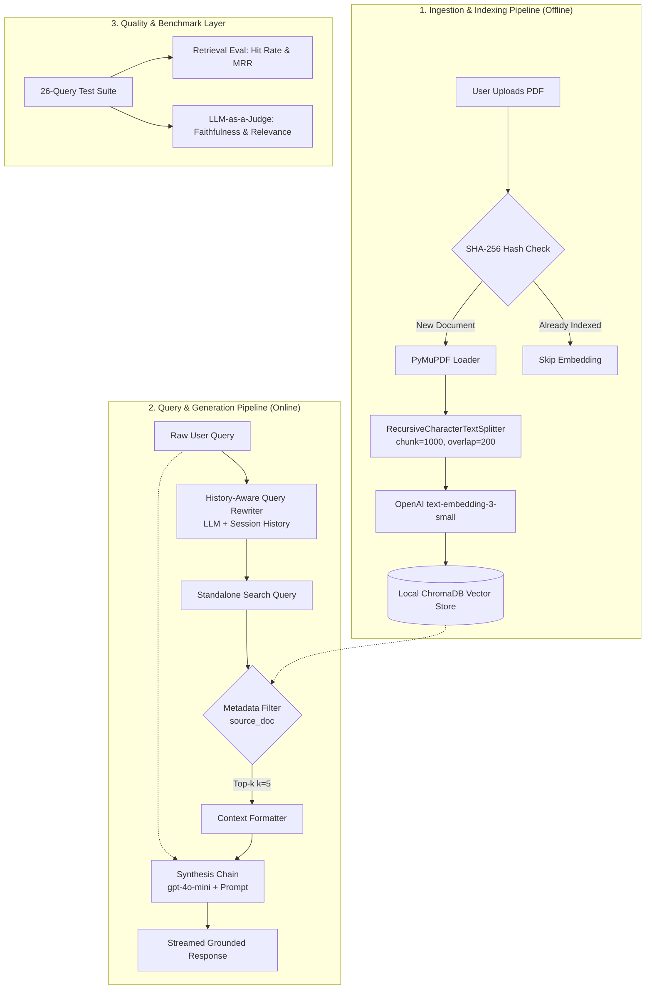

# Multi-Document Conversational RAG Assistant

A robust, multi-document Retrieval-Augmented Generation (RAG) system featuring history-aware query rewriting, metadata-filtered retrieval, and LLM-as-a-Judge evaluation.

---

## 1. Problem Statement

### Problem 1: Multi-Turn Context Loss
* **Issue:** Follow-up questions like *"Why does it happen?"* or *"What is its cost?"* suffer from pronoun ambiguity and conversational dependencies. Directly querying the vector database with raw follow-ups leads to severe retrieval degradation and low recall.
* **Solution:** Implemented a **History-Aware Query Rewriter**. A dedicated LLM reformulates user queries into standalone search terms using conversation history before querying the vector store.

### Problem 2: Multi-Document Information Pollution
* **Issue:** Indexing multiple unrelated documents into a single global index increases semantic noise, causing the retriever to pull irrelevant chunks across document boundaries (cross-contamination).
* **Solution:** Implemented **Metadata-Filtered Retrieval (Scoped Search)**. Users can scope searches to specific documents, ensuring the retriever operates strictly within target document chunks.

---

## Tech Stack & Architecture Components

| Layer / Component | Technology | Role & Justification |
| :--- | :--- | :--- |
| **Orchestration** | LangChain (LCEL) | Composable, pipeline-driven orchestration for query rewriting, retrieval scoping, and synthesis. |
| **LLM Engine** | OpenAI `gpt-4o-mini` | Cost-effective, high-reasoning model for query rewriting, response generation, and evaluation judging. |
| **Embeddings** | OpenAI `text-embedding-3-small` | 1536-dimensional dense vector embeddings for semantic chunk representation. |
| **Vector Database** | ChromaDB | Persistent local vector store with native metadata filtering (`source_doc` scoping). |
| **Document Parsing** | PyMuPDF (`fitz`) | Fast, structured page-level text extraction and whitespace normalization. |
| **Text Splitting** | LangChain Recursive Splitter | Context-preserving recursive chunking (`chunk_size=1000`, `chunk_overlap=200`). |
| **Schema Validation** | Pydantic v2 | Strict JSON schema enforcement for LLM-as-a-Judge structured evaluation outputs. |
| **User Interface** | Streamlit | Conversational UI with dynamic file management and multi-turn session state. |

## 2. Architecture & Pipelines



### 2.1 Ingestion & Indexing Pipeline
1. **Deduplication Check (SHA-256):** Computes the SHA-256 hash of the uploaded PDF to verify whether the document is already ingested. If indexed, redundant embedding generation is bypassed.
2. **Document Loading & Cleaning:** Reads pages using `PyMuPDFLoader`, strips extraneous whitespaces, and extracts structured page-level text.
3. **Chunking Strategy:** Splits documents using `RecursiveCharacterTextSplitter` into structured chunks with attached metadata (`source_doc`, `page_number`).
4. **Vector Storage:** Generates embeddings using OpenAI `text-embedding-3-small` and persists vectors into a local **ChromaDB** index.

### 2.2 Query & Generation Pipeline
1. **User Query & Context Ingestion:** Captures the raw user prompt alongside conversation history stored in session state / cache.
2. **History-Aware Query Rewriting:** Passes the chat history and the current prompt to the query rewriter chain, resolving conversational dependencies into an unambiguous, standalone search query.
3. **Scoped Vector Retrieval:** Queries ChromaDB using the standalone query, applying document metadata filters if a specific file is selected, and retrieves top-$k$ candidate chunks ($k=5$).
4. **Context Formatting & Synthesis:** Formats retrieved document chunks with source metadata and injects them into the synthesis prompt.
5. **Response Generation:** The primary LLM generates the grounded response, which is streamed back to the user and appended to the conversation history.

---

## 3. Evaluation & Benchmark Results

### 3.1 Evaluation Methodology
The evaluation suite benchmarks retrieval accuracy and generation quality across **26 structured test queries**:
* **18 Single-Turn (In-Scope):** Factual queries mapped to specific document chunks to measure baseline retrieval accuracy.
* **2 Single-Turn (Out-of-Scope):** Queries unsupported by the source documents, used to verify hallucination resistance and context boundary enforcement.
* **6 Multi-Turn Queries:** Conversational follow-up questions containing pronouns and implicit context references to evaluate query rewriting effectiveness.

#### Metrics
* **Hit Rate @ k:** Binary indicator of whether the ground-truth document chunk appears within the top-$k$ retrieved candidates.
* **MRR (Mean Reciprocal Rank):** Evaluates the rank position ($1/\text{rank}$) of the first relevant chunk, measuring how close the correct information is to the top.
* **Faithfulness & Relevance (LLM-as-a-Judge):** Graded on a 1–5 scale using `gpt-4o-mini` with structured Pydantic outputs. Out-of-scope queries that correctly return explicit refusal ("I do not have enough information") receive a score of 5.

---

### 3.2 Benchmark Tables

#### 1. Retrieval Window Optimization ($k$ Tuning)
*Evaluated at `CHUNK_SIZE=1000`, `OVERLAP_SIZE=200`.*

| Metric | $k=3$ | $k=5$ (Optimal) | $k=8$ |
| :--- | :--- | :--- | :--- |
| **Overall Hit Rate** | 73.08% (19/26) | **88.46% (23/26)** | 84.62% (22/26) |
| **Overall MRR** | 0.6026 | **0.6372** | 0.6372 |
| **Multi-Turn Baseline Hit Rate** | 66.67% (4/6) | 66.67% (4/6) | **83.33% (5/6)** |
| **Multi-Turn Baseline MRR** | 0.5000 | 0.5000 | **0.6042** |
| **Multi-Turn History-Aware Hit Rate** | **83.33% (5/6)** | **83.33% (5/6)** | **83.33% (5/6)** |
| **Multi-Turn History-Aware MRR** | 0.6389 | **0.6389** | **0.7222** |

#### 2. Chunk Size & Overlap Exploration ($k=5$ Fixed)

| Configuration (Chunk / Overlap) | Overall Hit Rate | Overall MRR | Multi-Turn Baseline MRR | Multi-Turn Rewritten MRR |
| :--- | :--- | :--- | :--- | :--- |
| **1000 / 100** | 88.46% | 0.6038 | 0.3056 | 0.5139 |
| **1000 / 200 (Selected)** | **88.46%** | **0.6372** | 0.5000 | **0.6389** |
| **1000 / 300** | 88.46% | 0.6327 | 0.4639 | 0.6389 |
| **1024 / 256** | 88.46% | 0.6359 | 0.3667 | 0.5556 |

#### 3. Generation Quality (LLM-as-a-Judge)

| Evaluation Metric | Score (1–5 Scale) | Evaluation Criteria |
| :--- | :--- | :--- |
| **Faithfulness** | **5.0 / 5.0** | Zero hallucination; statements strictly grounded in context. |
| **Answer Relevance** | **5.0 / 5.0** | Directly addresses user intent; handles out-of-scope gracefully. |

---

### 3.3 Key Findings & Engineering Insights

1. **Optimal Retrieval Window ($k=5$ Sweet Spot):**
   * Constraining retrieval to $k=3$ caused a sharp drop in Hit Rate (**73.08%**), indicating under-retrieval.
   * Expanding to $k=8$ maintained high recall but slightly decreased overall hit rate on single-turn questions due to irrelevant chunk interference (noise). $k=5$ provided the optimal balance between recall and precision.

2. **Context Boundary Degradation at Low Overlap (`1000/100`):**
   * Reducing chunk overlap to 100 characters caused Multi-Turn Baseline MRR to drop to **0.3056** and Rewritten MRR to **0.5139**.
   * Insufficient overlap split key contextual phrases across chunk boundaries, pushing relevant chunks to lower ranks. `1000/200` eliminated this fragmentation without redundant token overhead.

3. **Quantitative Proof of History-Aware Query Rewriting:**
   * Across all configurations, rewriting raw conversational prompts into standalone queries significantly boosted Multi-Turn MRR (from **0.5000 $\rightarrow$ 0.6389** at $k=5$, and **0.6042 $\rightarrow$ 0.7222** at $k=8$).
   * This proves that resolving conversational pronouns and antecedents brings the ground-truth chunk directly to top ranks (rank 1–2).

4. **Failure Analysis (Ceiling Effect on 3 Missed Queries):**
   * Across all chunking setups, Hit Rate plateaued at 88.46% (23/26).
   * Inspection of the 3 unretrieved questions revealed lexical mismatch where dense embeddings alone failed to bridge domain-specific phrasing. Integrating a **Cross-Encoder Reranker** or **Hybrid Search (BM25 + Dense)** is the primary mitigation strategy.

---

## 4. Quickstart & Setup

### Prerequisites
* Python 3.10+
* OpenAI API Key

### Installation
```bash
# 1. Clone the repository
git clone [https://github.com/](https://github.com/)<your-username>/multidoc_rag_assistant.git
cd multidoc_rag_assistant

# 2. Create and activate a virtual environment
python -m venv .venv
# On Windows:
.venv\Scripts\activate
# On Linux/macOS:
source .venv/bin/activate

# 3. Install dependencies
pip install -r requirements.txt

# 4. Configure environment variables
# Create a .env file with your OpenAI API key:
echo OPENAI_API_KEY="your-openai-api-key" > .env
````

### Running the Evaluation Suite

Bash

```
# Run Retrieval Benchmarks (Hit Rate & MRR)
python -m eval.retrieval_evaluation

# Run Generation Evaluation (LLM-as-a-Judge)
python -m eval.generation_evaluation
```

### Running the Application UI

Bash

```
streamlit run app.py
```

## 5. Limitations & Future Roadmap

- **Hybrid Search Integration:** Dense embeddings struggle with exact lexical matches (e.g., specific acronyms, error codes). Adding a BM25 sparse retriever combined with Reciprocal Rank Fusion (RRF) is planned to resolve the remaining 11.5% retrieval misses.
    
      
    
- **Cross-Encoder Reranking:** Adding a lightweight reranker (e.g., `bge-reranker-large` or Cohere Rerank) over top-15 candidates to further optimize MRR before LLM context injection.
    
      
    
- **Async & Batch Processing:** Converting sequential evaluation and ingestion loops to asynchronous calls (`asyncio` / `aquery`) to reduce evaluation latency.
    
      
    
- **StateGraph Architecture Migration:** Migrating conversation state management from `RunnableWithMessageHistory` to **LangGraph** checkpointers for advanced multi-agent branching and persistence.
