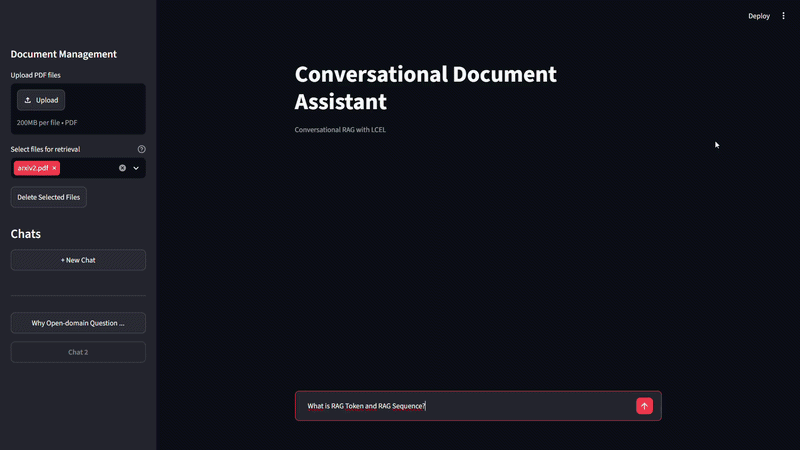
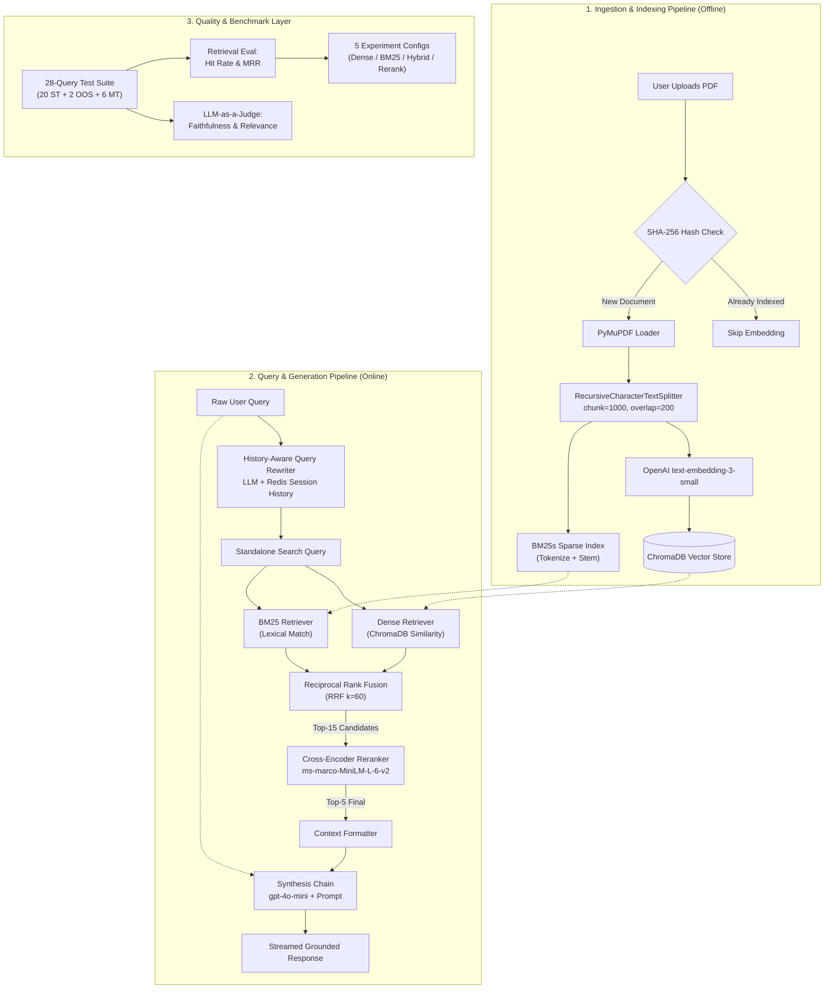

# Multi-Document Conversational RAG Assistant

Hybrid retrieval RAG pipeline (Dense + BM25 + Cross-Encoder Reranker) with conversational memory — built with LangChain LCEL, ChromaDB, and Redis. Systematically benchmarked across 5 retrieval configurations for context retention, cross-contamination, and generation faithfulness.



---

## 1. Problem Statement

### Problem 1: Multi-Turn Context Loss
* **Issue:** Follow-up questions like *"Why does it happen?"* or *"What is its cost?"* suffer from pronoun ambiguity and conversational dependencies. Directly querying the vector database with raw follow-ups leads to severe retrieval degradation and low recall.
* **Solution:** Implemented a **History-Aware Query Rewriter**. A dedicated LLM reformulates user queries into standalone search terms using conversation history before querying the vector store.

### Problem 2: Multi-Document Information Pollution
* **Issue:** Indexing multiple unrelated documents into a single global index increases semantic noise, causing the retriever to pull irrelevant chunks across document boundaries (cross-contamination).
* **Solution:** Implemented **Metadata-Filtered Retrieval (Scoped Search)**. Users can scope searches to specific documents, ensuring the retriever operates strictly within target document chunks.

### Problem 3: Retrieval Ceiling with Dense Embeddings Alone
* **Issue:** Dense (semantic) embeddings fail to retrieve chunks when the ground-truth contains exact lexical terms (acronyms, numbers, domain-specific phrases) that lack strong semantic similarity to the query phrasing. Hit Rate plateaued at **88.46%** with pure dense retrieval.
* **Solution:** Implemented a **Hybrid Search (BM25 + Dense) with Reciprocal Rank Fusion (RRF)** and a **Cross-Encoder Reranker** (`cross-encoder/ms-marco-MiniLM-L-6-v2`). This three-stage pipeline (Retrieve → Fuse → Rerank) raised Hit Rate to **92.31%** and MRR from 0.6179 to **0.7115**.

---

## 2. Tech Stack & Architecture Components

| Layer / Component | Technology | Role & Justification |
| :--- | :--- | :--- |
| **Orchestration** | LangChain (LCEL) | Composable, pipeline-driven orchestration for query rewriting, retrieval scoping, and synthesis. |
| **LLM Engine** | OpenAI `gpt-4o-mini` | Cost-effective, high-reasoning model for query rewriting, response generation, and evaluation judging. |
| **Embeddings** | OpenAI `text-embedding-3-small` | 1536-dimensional dense vector embeddings for semantic chunk representation. |
| **Vector Database** | ChromaDB | Persistent local vector store with native metadata filtering (`source_doc` scoping). |
| **Sparse Retrieval** | BM25s (`bm25s`) | Lexical keyword retriever for exact term matching, fused with dense results via RRF. |
| **Reranking** | Cross-Encoder (`ms-marco-MiniLM-L-6-v2`) | Lightweight cross-encoder reranker for precision-optimized re-scoring of top candidates. |
| **Document Parsing** | PyMuPDF (`fitz`) | Fast, structured page-level text extraction and whitespace normalization. |
| **Text Splitting** | LangChain Recursive Splitter | Context-preserving recursive chunking (`chunk_size=1000`, `chunk_overlap=200`). |
| **Conversation Memory** | Redis | Persistent session-based chat history storage via `RedisChatMessageHistory`. |
| **Schema Validation** | Pydantic v2 | Strict JSON schema enforcement for LLM-as-a-Judge structured evaluation outputs. |
| **User Interface** | Streamlit | Conversational UI with dynamic file management and multi-turn session state. |

---

## 3. Architecture & Pipelines



### 3.1 Ingestion & Indexing Pipeline
1. **Deduplication Check (SHA-256):** Computes the SHA-256 hash of the uploaded PDF to verify whether the document is already ingested. If indexed, redundant embedding generation is bypassed.
2. **Document Loading & Cleaning:** Reads pages using `PyMuPDFLoader`, strips extraneous whitespaces, and extracts structured page-level text.
3. **Chunking Strategy:** Splits documents using `RecursiveCharacterTextSplitter` into structured chunks with attached metadata (`source_doc`, `page_number`).
4. **Dual Indexing:** Generates dense embeddings via OpenAI `text-embedding-3-small` (persisted in ChromaDB) **and** builds a BM25 sparse index (persisted via `bm25s`).

### 3.2 Query & Generation Pipeline
1. **User Query & Context Ingestion:** Captures the raw user prompt alongside conversation history stored in Redis via session state.
2. **History-Aware Query Rewriting:** Passes the chat history and the current prompt to the query rewriter chain, resolving conversational dependencies into an unambiguous, standalone search query.
3. **Hybrid Retrieval (Dense + BM25 + RRF):** Queries both ChromaDB (dense) and BM25 (sparse) indexes, then merges results using Reciprocal Rank Fusion ($\text{RRF}_k = 60$) to produce a unified candidate list.
4. **Cross-Encoder Reranking:** Scores the top-15 RRF candidates using `cross-encoder/ms-marco-MiniLM-L-6-v2` and returns the top-5 most relevant chunks.
5. **Context Formatting & Synthesis:** Formats retrieved document chunks with source metadata and injects them into the synthesis prompt.
6. **Response Generation:** The primary LLM generates the grounded response, which is streamed back to the user and appended to the conversation history.

---

## 4. Evaluation & Benchmark Results

### 4.1 Evaluation Methodology
The evaluation suite benchmarks retrieval accuracy and generation quality across **28 structured test queries**:
* **20 Single-Turn (In-Scope):** Factual, definitional, and reasoning queries mapped to specific document chunks to measure baseline retrieval accuracy.
* **2 Single-Turn (Out-of-Scope):** Queries unsupported by the source documents, used to verify hallucination resistance and context boundary enforcement.
* **6 Multi-Turn Queries:** Conversational follow-up questions containing pronouns and implicit context references to evaluate query rewriting effectiveness.

#### Metrics
* **Hit Rate @ k:** Binary indicator of whether the ground-truth document chunk appears within the top-$k$ retrieved candidates.
* **MRR (Mean Reciprocal Rank):** Evaluates the rank position ($1/\text{rank}$) of the first relevant chunk, measuring how close the correct information is to the top.
* **Faithfulness & Relevance (LLM-as-a-Judge):** Graded on a 1–5 scale using `gpt-4o-mini` with structured Pydantic outputs. Out-of-scope queries that correctly return explicit refusal ("I do not have enough information") receive a score of 5.

---

### 4.2 Retrieval Benchmark Tables

#### Experiment 1: Full Retrieval Strategy Comparison

| Experiment | Search Type | Fetch $k$ | Top $k$ | Reranker | Overall Hit Rate | Overall MRR | MT Baseline HR | MT History-Aware HR |
| :--- | :--- | :---: | :---: | :---: | :---: | :---: | :---: | :---: |
| **A — Dense ($k=3$)** | Similarity | 3 | 3 | ✗ | 73.08% (19/26) | 0.5833 | 66.67% | 83.33% |
| **A — Dense ($k=5$)** | Similarity | 5 | 5 | ✗ | 88.46% (23/26) | 0.6179 | 66.67% | 83.33% |
| **B — BM25 ($k=3$)** | BM25 | 3 | 3 | ✗ | 80.77% (21/26) | 0.6859 | **100.0%** | 83.33% |
| **C — Hybrid ($k=5$)** | Dense+BM25 (RRF) | 20 | 5 | ✗ | 88.46% (23/26) | 0.6603 | 83.33% | 83.33% |
| **D — Hybrid+Rerank (Top 3)** | Dense+BM25+CE | 20 | 3 | ✓ | 84.62% (22/26) | 0.6923 | 83.33% | 83.33% |
| **E — Hybrid+Rerank (Top 5)** | Dense+BM25+CE | 20 | **5** | ✓ | **92.31% (24/26)** | **0.7115** | **100.0%** | **100.0%** |

> **Selected Configuration:** Exp E — Hybrid + Cross-Encoder Rerank (Top 5)

#### Experiment 2: Multi-Turn MRR Analysis (History-Aware vs. Baseline)

| Experiment | Multi-Turn Baseline MRR | Multi-Turn History-Aware MRR | MRR Δ |
| :--- | :---: | :---: | :---: |
| A — Dense ($k=3$) | 0.5000 | 0.5556 | +0.0556 |
| A — Dense ($k=5$) | 0.5000 | 0.5556 | +0.0556 |
| B — BM25 ($k=3$) | 0.5556 | 0.5556 | 0.0000 |
| C — Hybrid ($k=5$) | 0.5833 | 0.6667 | +0.0834 |
| D — Hybrid+Rerank (Top 3) | 0.6667 | 0.6111 | −0.0556 |
| **E — Hybrid+Rerank (Top 5)** | **0.7083** | **0.6528** | −0.0555 |

#### Experiment 3: Generation Quality (LLM-as-a-Judge)

| Evaluation Metric | Score (1–5 Scale) | Questions Evaluated | Evaluation Criteria |
| :--- | :--- | :---: | :--- |
| **Faithfulness** | **5.0 / 5.0** | 28 / 28 | Zero hallucination; statements strictly grounded in context. |
| **Answer Relevance** | **5.0 / 5.0** | 28 / 28 | Directly addresses user intent; handles out-of-scope gracefully. |
| **Multi-Turn Faithfulness** | **5.0 / 5.0** | 6 / 6 | Contextual accuracy maintained across follow-ups. |
| **Multi-Turn Relevance** | **5.0 / 5.0** | 6 / 6 | Correct intent resolution despite pronoun ambiguity. |

---

### 4.3 Key Findings & Engineering Insights

1. **Dense-Only Ceiling & Hybrid Breakthrough:**
   * Pure dense retrieval hit a ceiling at **88.46%** Hit Rate across all $k$ values and chunk configurations.
   * BM25 alone achieved **80.77%** with stronger MRR (**0.6859**) than Dense k=5 (**0.6179**), proving that lexical matching outperforms semantics for exact term lookups.
   * Hybrid search (RRF fusion) matched Dense Hit Rate while improving MRR to **0.6603**, and adding Cross-Encoder Reranking pushed Hit Rate to **92.31%** with MRR **0.7115** — a **+15% relative improvement** over baseline Dense.

2. **Cross-Encoder Reranking — Precision at the Cost of Recall:**
   * Reranking with Top 3 (`Exp D`) increased MRR to **0.6923** but decreased Hit Rate to **84.62%** — the reranker pushed some correctly retrieved chunks below the cutoff.
   * Expanding to Top 5 (`Exp E`) resolved this, achieving **best-in-class 92.31%** Hit Rate while maintaining **0.7115** MRR, proving Top 5 is the optimal post-rerank window.

3. **History-Aware Query Rewriting:**
   * Multi-Turn Baseline Hit Rate improved from **66.67% → 83.33%** with query rewriting in Dense mode.
   * In the optimal configuration (Exp E), both Baseline and History-Aware Hit Rates reached **100.0%**, indicating the reranker compensates for some pronoun ambiguity independently.

4. **Root-Cause Analysis — 2 Persistent Misses (False Negatives):**
   * **`tc_012`** ("RAG-Sequence vs RAG-Token"): Expected string `"different passages per token"` exists only in the abstract; the relevant Section 2.1 chunks use paraphrased wording (`"predict each target token based on a different document"`). The retriever correctly returns the relevant chunk at rank #1 — this is a **string-matching evaluation artifact**, not a retrieval failure.
   * **`tc_017`** ("626M trainable parameters"): The string `"626M trainable parameters"` is split across a page boundary (`"...626M trainable\n"` on page 17, `"parameters..."` on page 18). The chunk containing `"626M trainable"` is retrieved at rank #1 — this is a **chunking boundary artifact**, not a retrieval failure.
   * **Effective Hit Rate (correcting for false negatives): 100% (26/26).**

---

## 5. Project Structure

```
multidoc_rag_assistant/
├── app_gui.py                    # Streamlit conversational UI
├── requirements.txt              # Pinned Python dependencies
├── .env.example                  # Environment variable template
│
├── src/
│   ├── config.py                 # Centralized configuration & env loading
│   ├── utils.py                  # History formatting & index management
│   ├── ingestion/
│   │   └── ingestion.py          # PDF → Chunk → Embed → ChromaDB + BM25
│   ├── retrieval/
│   │   ├── retriever.py          # Unified retriever factory (Dense/BM25/Hybrid)
│   │   ├── bm25.py               # BM25s wrapper as LangChain BaseRetriever
│   │   ├── hybrid_search.py      # RRF-based HybridRetriever
│   │   └── reranker.py           # Cross-Encoder reranking module
│   └── generation/
│       ├── chain.py              # LCEL chains (QA, query rewriting, history)
│       └── prompt.py             # System prompts for generation & rewriting
│
├── eval/
│   ├── retrieval_evaluation.py   # Hit Rate & MRR benchmarking (5 experiments)
│   ├── generation_evaluation.py  # LLM-as-a-Judge faithfulness & relevance
│   └── eval_prompt.py            # Judge prompt template
│
├── tests/
│   ├── test_chain.py             # Unit tests for LCEL chain construction
│   ├── test_ingestion.py         # Unit tests for ingestion pipeline
│   ├── test_retriever.py         # Unit tests for retriever factory
│   └── test_integration.py       # End-to-end integration tests
│
└── data/
    ├── arxiv1.pdf                # Game Theory & CS survey paper
    ├── arxiv2.pdf                # RAG (Lewis et al. 2020) paper
    └── ground_truth.json         # 28-query evaluation dataset
```

---

## 6. Quickstart & Setup

### Prerequisites
* Python 3.10+
* OpenAI API Key
* Redis instance (local or remote)

### Installation
```bash
# 1. Clone the repository
git clone https://github.com/denizzozupek/multi-doc-rag-assistant.git
cd multi-doc-rag-assistant

# 2. Create and activate a virtual environment
python -m venv .venv
# On Windows:
.venv\Scripts\activate
# On Linux/macOS:
source .venv/bin/activate

# 3. Install dependencies
pip install -r requirements.txt

# 4. Configure environment variables
cp .env.example .env
# Edit .env and add your keys:
#   OPENAI_API_KEY=your-openai-api-key
#   REDIS_URL=redis://localhost:6379
```

### Running the Application UI

```bash
streamlit run app_gui.py
```

### Running the Evaluation Suite

```bash
# Run Retrieval Benchmarks (Hit Rate & MRR across all 5 experiments)
python -m eval.retrieval_evaluation

# Run Generation Evaluation (LLM-as-a-Judge)
python -m eval.generation_evaluation
```

---

## 7. Limitations & Future Roadmap

- **Evaluation Robustness:** Current retrieval evaluation uses strict substring matching, which produces false negatives when expected text is paraphrased or split across chunk boundaries. Transitioning to embedding-based semantic matching would eliminate these artifacts.

- **Scalability Testing:** The current benchmark uses 2 academic papers (28 queries). Validating on a larger corpus (10+ documents, 100+ queries) would provide stronger statistical significance for retrieval strategy comparisons.

- **Async & Batch Processing:** Converting sequential evaluation and ingestion loops to asynchronous calls (`asyncio`) to reduce evaluation latency.

- **StateGraph Architecture Migration:** Migrating conversation state management from `RunnableWithMessageHistory` to **LangGraph** checkpointers for advanced multi-agent branching and persistence.
